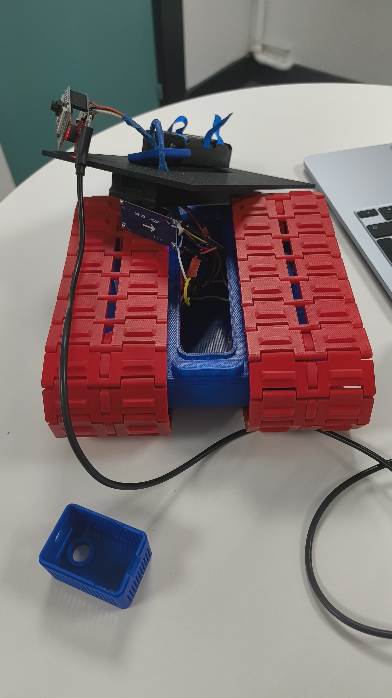
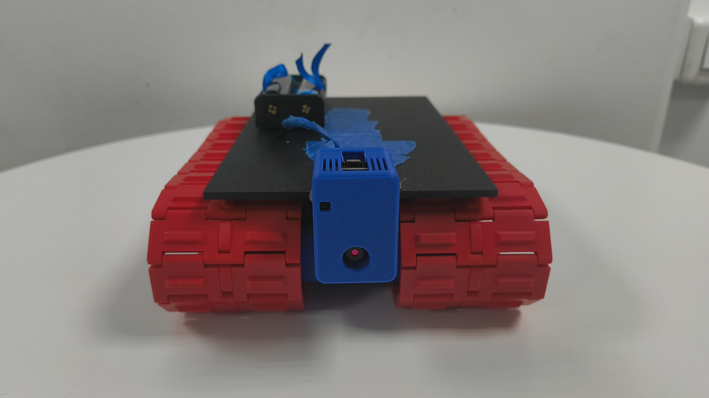
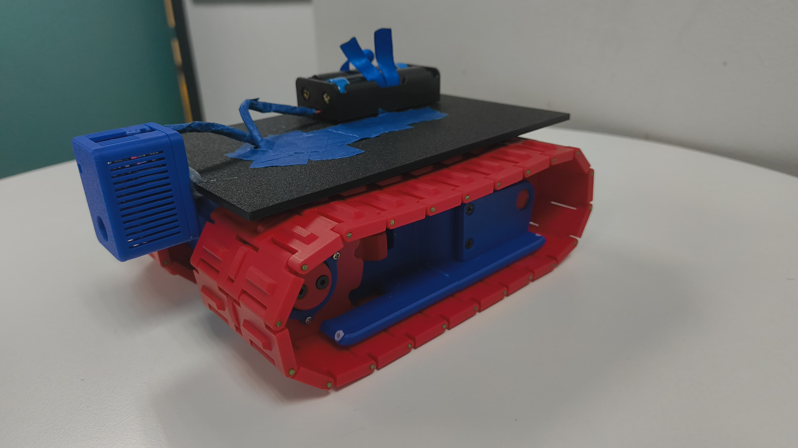

<div align="center">


<br/>

# Robot-Tank: FPV Control via ESP32-CAM

**TIC-RBT1 • Project 2 • ETNA**


</div>

## 👥 Team

<table>
  <tr>
	<td valign="middle">
	  <strong>Module :</strong> TIC-RBT1 &nbsp;•&nbsp; <strong>Delivered :</strong> Mai 2026<br/>
	  <strong>Co-Labs ETNA</strong> • Team of 4<br/><br/>
	  <code>corde_t</code><br/>
	  <code>judea_d</code><br/>
	  <code>kingki_n</code><br/>
	  <code>brouar_l</code>
	</td>
	<td valign="middle" align="center">
  <br>
  
</td>
  </tr>
</table>

## 🎯 Overview

This project involves building and programming a **remotely controlled FPV (First Person View) tank** based on the ESP32-CAM. The robot is controlled wirelessly via an onboard web interface, accessible from any browser connected to the tank’s Wi-Fi network.

The ESP32-CAM simultaneously handles two critical tasks:

```
┌─────────────────────────────────────────┐
│  ESP32-CAM                              │
│                                         │
│  Core 0 → Streaming vidéo (OV2640)      │
│  Core 1 → Serveur HTTP (commandes)      │
└─────────────────────────────────────────┘
```

The commands received (`/forward`, `/backward`, `/left`, `/right`, `/stop`) are converted into **PWM** signals sent to the dual ESC, which controls the two DC motors of the tracks independently.

---

## 🧩 Components

| Component                        | Quantity | Function                                                |
| -------------------------------- | -------- | ------------------------------------------------------- |
| ESP32-CAM                        | 1        | Brain: WiFi, HTTP server, FPV video stream              |
| USB programming module           | 1        | Code upload interface                                   |
| Tank chassis with tracks         | 1        | All-terrain mechanical structure                        |
| DC Motors                        | 2        | Left and right track propulsion                         |
| Dual ESC (dual speed controller) | 1        | Motor speed & direction control via PWM                 |
| LM2596 voltage regulator         | 1        | Steps down battery voltage to a stable 5V for the ESP32 |
| LiPo battery                     | 1        | Main power supply for the system                        |
| M3 / M3.5 screws                 | ~50      | Mechanical fasteners for the assembly                   |
| Threaded inserts                 | 13       | Fasteners for 3D-printed parts                          |

---

## 🔌 Wiring Diagram


> The diagram is also available in the `wiring_diagram.pdf` file included in the repository.

### Overview

```
LiPo battery
    │
    ├──► ESC (motor power supply)
    │        ├── Left motor
    │        └── Right motor
    │
	└──► LM2596 (5V regulator)
             └──► ESP32-CAM (5V / GND)
                      ├── GPIO → Left channel ESC PWM signal
                      └── GPIO → Right channel ESC PWM signal
```

## 🖥️ Web UI

The interface is served directly by the ESP32-CAM as **HTML embedded** in the sketch. It can be accessed from any browser on the tank’s network.

**Features:**

- Real-time video feed
- 5 directional buttons: ↑ ↓ ← → ⏹

---

### ESP32-CAM → ESC

| ESP32-CAM Pin | ESC Channel   | Function               |
| ------------- | ------------- | ---------------------- |
| GPIO 14       | Left channel  | Left track PWM signal  |
| GPIO 15       | Right channel | Right track PWM signal |
| GND           | ESC GND       | Common ground          |

### LM2596 → ESP32-CAM

| LM2596 Output | ESP32-CAM Pin |
| ------------- | ------------- |
| +5V           | 5V            |
| GND           | GND           |

> ⚠️ Set the LM2596 to **exactly 5V** before connecting the ESP32-CAM — check with a multimeter. A voltage higher than 5.5V can permanently damage the module.

## 🚀 Installation & Deployment

### Prerequisites

- [Arduino IDE](https://www.arduino.cc/en/software) 2.x
- ESP32 package installed via the Boards Manager (`https://espressif.github.io/arduino-esp32/package_esp32_index.json`)
- `esp32-camera` library (included in the ESP32 package)
- USB programming module connected to the ESP32-CAM

### Uploading

```bash
# 2. Open Server.ino in the Arduino IDE

# 3. Select the board
# Tools → Board Type → AI Thinker ESP32-CAM

# 4. Configure the WiFi SSID/password in the sketch

# 5. Connect the USB programming module
#    → Set GPIO0 to GND during upload (flash mode)

# 6. Upload - Ctrl+U

# 7. After upload: disconnect GPIO0 from GND, press Reset

# 8. Open the serial monitor at 115200 baud to retrieve the IP address
```

## ⚡ Issues encountered

- **ESC arming**: without sending the neutral signal at startup, the ESC remained locked in safety mode. Resolved by adding a PWM initialization sequence in `setup()`.

- **Streaming/HTTP conflict**: the video stream and the command server were blocking each other. Resolved by assigning streaming and commands to two separate tasks via `xTaskCreatePinnedToCore()`.
  x

---

<div align="center">


_Project completed at Co-Labs ETNA · ICT-RBT1 Module · May 2026_

[Corde_t](https://github.com/ThomasC-Banks) • [Judea_d](https://github.com/David-JUDEA) • [Kingki_n](https://github.com/lkb113) • [Brouar_l](https://github.com/JustKIKS)

</div>

## Gallery :

#### Testing and assembly :



---

#### Showcasing I :



---

#### Showcasing I :



---

###### (Video coming soon...)

---

_**A big thanks to ETNA for this project.**_
