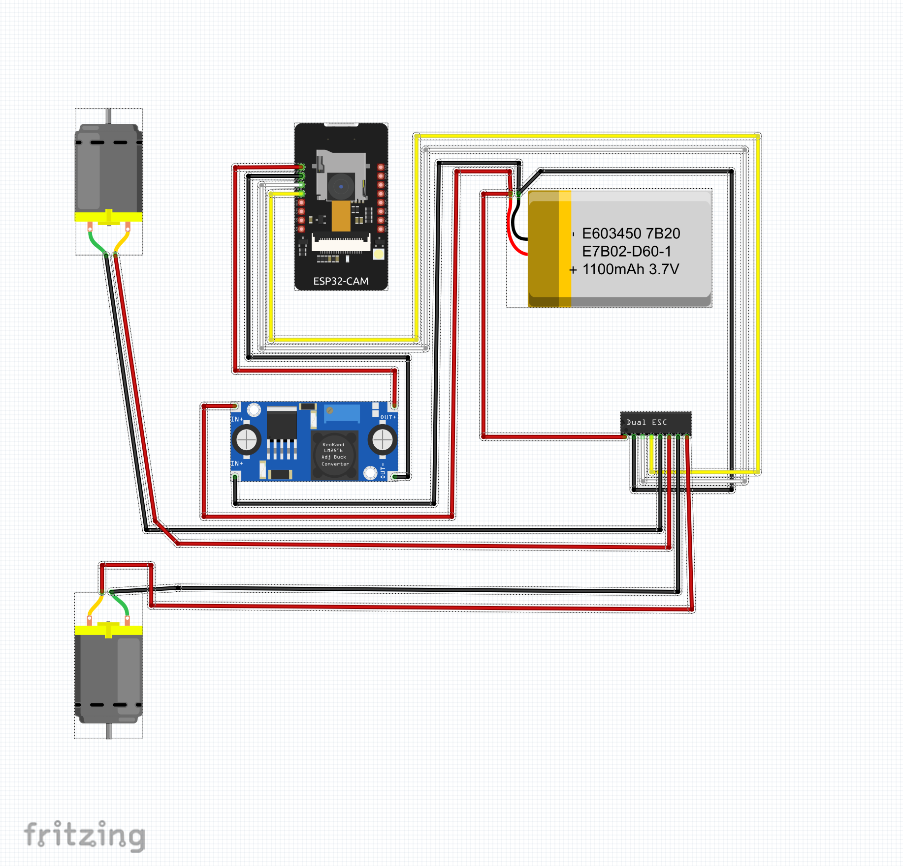

<div align="center">

<!-- Remplace ce placeholder par ton GIF/photo principal du tank -->


<br/>

# 🦾 Robot-Tank: Pilotage FPV via ESP32-CAM

**TIC-RBT1 · Projet 2 · ETNA**


</div>

---

## 👥 Équipe

<table>
  <tr>
	<td valign="middle">
	  <strong>Module :</strong> TIC-RBT1 &nbsp;·&nbsp; <strong>Rendu :</strong> Mai 2026<br/>
	  <strong>Co-Labs ETNA</strong> · Groupe de 4<br/><br/>
	  <code>corde_t</code><br/>
	  <code>judea_d</code><br/>
	  <code>kingki_n</code><br/>
	  <code>brouar_l</code>
	</td>
	<td valign="middle" align="center">
  <br>
  
</td>
  </tr>
</table>

---

## 🎯 Présentation

Ce projet consiste en la construction et la programmation d'un **tank téléopéré en FPV** (_First Person View_) à base d'ESP32-CAM. Le robot est piloté sans fil via une interface web embarquée, accessible depuis n'importe quel navigateur connecté au réseau WiFi du tank.

L'ESP32-CAM gère simultanément deux tâches critiques :

```
┌─────────────────────────────────────────┐
│  ESP32-CAM                              │
│                                         │
│  Core 0 → Streaming vidéo (OV2640)      │
│  Core 1 → Serveur HTTP (commandes)      │
└─────────────────────────────────────────┘
```

Les commandes reçues (`/forward`, `/backward`, `/left`, `/right`, `/stop`) sont traduites en signaux **PWM** envoyés au variateur double (ESC), qui pilote les deux moteurs DC des chenilles indépendamment.

---

## 🧩 Composants

| Composant                    | Quantité | Rôle                                                 |
| ---------------------------- | -------- | ---------------------------------------------------- |
| ESP32-CAM                    | 1        | Cerveau : WiFi, serveur HTTP, flux vidéo FPV         |
| Module de programmation USB  | 1        | Interface de téléversement du code                   |
| Châssis tank avec chenilles  | 1        | Structure mécanique tout-terrain                     |
| Moteurs DC                   | 2        | Propulsion chenille gauche et chenille droite        |
| Dual ESC (variateur double)  | 1        | Contrôle vitesse & sens des moteurs via PWM          |
| Régulateur de tension LM2596 | 1        | Abaisse la tension batterie à 5V stable pour l'ESP32 |
| Batterie LiPo                | 1        | Alimentation principale du système                   |
| Visserie M3 / M3.5           | ~50      | Fixation mécanique de l'ensemble                     |
| Inserts filetés              | 13       | Fixation dans les pièces imprimées 3D                |

---

## 🔌 Schéma de câblage



> Le schéma est également disponible dans le fichier `schema_cablage.pdf` inclus dans le dépôt.

### Vue d'ensemble

```
Batterie LiPo
	│
	├──► ESC (alimentation moteurs)
	│        ├── Moteur gauche
	│        └── Moteur droit
	│
	└──► LM2596 (régulateur 5V)
			 └──► ESP32-CAM (5V / GND)
					  ├── GPIO → Signal PWM ESC canal gauche
					  └── GPIO → Signal PWM ESC canal droit
```

---

## 🖥️ Interface Web UI

L'interface est servie directement par l'ESP32-CAM sous forme de **HTML embarqué** dans le sketch. Elle est accessible depuis n'importe quel navigateur sur le réseau du tank.

**Fonctionnalités :**

- Flux vidéo en temps réel
- 5 boutons de direction : ↑ ↓ ← → ⏹

---

### ESP32-CAM → ESC

| Broche ESP32-CAM | Canal ESC    | Rôle                       |
| ---------------- | ------------ | -------------------------- |
| GPIO 14          | Canal gauche | Signal PWM chenille gauche |
| GPIO 15          | Canal droit  | Signal PWM chenille droite |
| GND              | GND ESC      | Masse commune              |

### LM2596 → ESP32-CAM

| Sortie LM2596 | Broche ESP32-CAM |
| ------------- | ---------------- |
| +5V           | 5V               |
| GND           | GND              |

> ⚠️ Régler le LM2596 à **5V exactement** avant de connecter l'ESP32-CAM — vérifier à la multimètre. Une tension supérieure à 5,5V peut endommager irrémédiablement le module.

---

## 🚀 Installation & déploiement

### Prérequis

- [Arduino IDE](https://www.arduino.cc/en/software) 2.x
- Package ESP32 installé via le Boards Manager (`https://espressif.github.io/arduino-esp32/package_esp32_index.json`)
- Bibliothèque `esp32-camera` (incluse dans le package ESP32)
- Module de programmation USB branché sur l'ESP32-CAM

### Téléversement

```bash
# 2. Ouvrir Server.ino dans l'Arduino IDE

# 3. Sélectionner la carte
# Outils → Type de carte → AI Thinker ESP32-CAM

# 4. Configurer le SSID/mot de passe WiFi dans le sketch

# 5. Brancher le module de programmation USB
#    → Mettre GPIO0 à GND pendant le téléversement (mode flash)

# 6. Téléverser - Ctrl+U

# 7. Après téléversement : débrancher GPIO0 de GND, appuyer sur Reset

# 8. Ouvrir le moniteur série à 115200 baud pour récupérer l'adresse IP
```

---

## ⚡ Difficultés rencontrées

- **Armement de l'ESC** : sans envoi du signal neutre au démarrage, l'ESC restait bloqué en sécurité. Résolution en ajoutant une séquence d'initialisation PWM dans le `setup()`.
- **Inserts filetés** : température trop élevée du fer à souder entraînant une déformation des pièces imprimées. Résolution en travaillant à ~200°C avec des appuis courts et répétés plutôt qu'un seul appui prolongé.
- **Conflit streaming / HTTP** : le flux vidéo et le serveur de commandes se bloquaient mutuellement. Résolution en assignant le streaming et les commandes à deux tâches distinctes via `xTaskCreatePinnedToCore()`.

---

<div align="center">


_Projet réalisé au Co-Labs ETNA · Module TIC-RBT1 · Mai 2026_

`corde_t` · `judea_d` · `kingki_n` · `brouar_l`

</div>
# Robot-Tank
